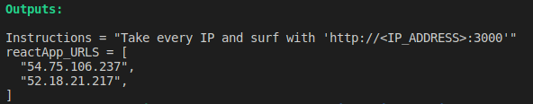

# Deployment steps for the [Red Project](https://drive.google.com/file/d/10p8pGgD14EbtHpU-fOyjrtS5whgc42oo/view)

1. [Install Terraform](https://developer.hashicorp.com/terraform/tutorials/aws-get-started/install-cli)

2. Install AWS CLI and [Configuring the AWS CLI](https://docs.aws.amazon.com/cli/latest/userguide/cli-chap-configure.html)

3. Set the variable values to your AWS infrastructure in the **variables.tf** file

4. (Optional) - If you have more than one IAM profile on your local machine - You can choose what profile to add as a value for the "profile" variable in the **variables.tf** file

5. To execute the project - follow the commands from the **Red-Project-reactApp** directory:
```
terraform init

terraform plan -out tfplan

terraform apply "tfplan"
```

6. Connect to the instance with the reactApp_URL link



7. After finishing with the project you may destroy the infrustructure 
```
terraform destroy --auto-approve
```


## * Notes
```
The project will deploy Security Group, and Amazon Linux instance on the N.Virginia region.
```